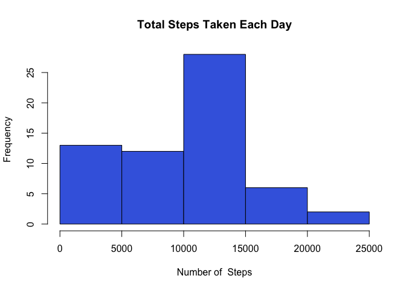
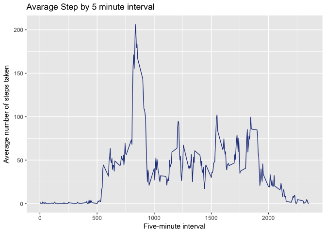
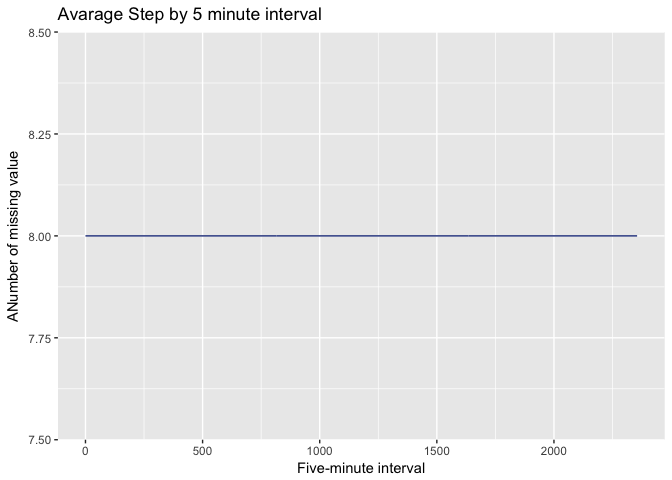
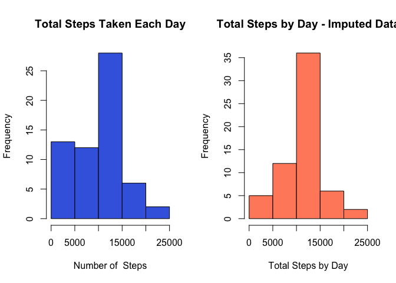
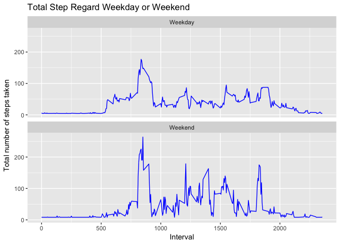

# Reproducible Research: Peer Assessment 1

###About this Assesment
This is the first assement for the **Reproducible Research** course in Coursera's Plataform.
The project aims to answer some questions using data collected from a [FitBit](http://en.wikipedia.org/wiki/Fitbit).
In the next steps, it is describe the analysis process.

## Loading and preprocessing the data

The data were download from the [course's webpage](https://d396qusza40orc.cloudfront.net/repdata%2Fdata%2Factivity.zip) and read using read.csv function:


```r
### Read the file
temp <- tempfile()
download.file("https://d396qusza40orc.cloudfront.net/repdata%2Fdata%2Factivity.zip",temp)
data <- read.csv(unz(temp, "activity.csv"))
unlink(temp)
```
## What is mean total number of steps taken per day?

Sum steps by day (1), create Histogram (2), and calculate mean and median.

```r
#### Aggregatin data by day
data$date1<-as.Date(data$date, "%Y-%m-%d")
total.step.day<-aggregate(data$steps, list(date=data$date1), sum, na.rm=TRUE)
names(total.step.day)<-c("date", "total.step")

### making the histgram
library(ggplot2)
hist(total.step.day$total.step, main = paste("Total Steps Taken Each Day"), xlab = "Number of  Steps", col="royalblue")
```

<!-- -->

```r
### Calculating mean and median
step.mean<-mean(total.step.day$total.step)
step.median<-median(total.step.day$total.step)
```

The avarage step taken in one day is 9354.2295082, and the median is 10395.

## What is the average daily activity pattern?

1) Calculate average steps for each interval for all days.
2) Plot the Average Number Steps per Day by Interval.
3) Find interval with most average steps.


```r
avarage.step.interval<-aggregate(x=list(avg.step=data$steps),by=list(interval=data$interval), FUN= mean, na.rm=TRUE)

### Make the plot
library(ggplot2)
p<-ggplot(data=avarage.step.interval, aes(x=interval, y=avg.step))
p+geom_line(color="royalblue4") + ggtitle("Avarage Step by 5 minute interval") + xlab('Five-minute interval') +
  ylab('Average number of steps taken') 
```

<!-- -->

```r
### Maximum value
maximun<-max(avarage.step.interval$avg.step)
max.interval<-avarage.step.interval[(avarage.step.interval$avg.step==maximun),]
```
The five-minute interval, on average across all the days in the data set, containing the maximum number of steps is **835, 206.1698113.**


## Imputing missing values
  1) Describe missing values

```r
data$miss.value<-is.na(data$steps)
miss.value.mean<-(mean(data$miss.value))*100
total.missing.interval<-aggregate(x=list(total.missing=data$miss.value),by=list(interval=data$interval), FUN= sum)
```
The dataset contain **13.1147541** % of missing values. There are 8 missing value for each five-minute inteval, as it possible to see in the next plot: 


```r
p<-ggplot(total.missing.interval, aes(x=interval, y=total.missing))
p+geom_line(color="royalblue4") + ggtitle("Avarage Step by 5 minute interval") + xlab('Five-minute interval') +
  ylab('ANumber of missing value')
```

<!-- -->

As there is no difference in the missing value's distribution,  it is posible to imputate the missing value as the mean of the steps.

```r
### Impute Missing value

#### Create a new dataset & impute the median for NA
data_Imputed_steps <- data
data_Imputed_steps$steps[(is.na(data$steps)=="TRUE")]<-mean(data$steps, na.rm=TRUE)
```

Now let's recount total steps by day and create Histogram.


```r
### Making histogram
total.step.day.imputed<-aggregate(data_Imputed_steps$steps, list(date=data$date1), sum, na.rm=TRUE)
names(total.step.day.imputed)<-c("date", "total.steps" )

par(mfrow=c(1,2))

hist(total.step.day$total.step, main = paste("Total Steps Taken Each Day"), xlab = "Number of  Steps", col="royalblue")
hist(total.step.day.imputed$total.steps, xlab = "Total Steps by Day", main="Total Steps by Day - Imputed Data", col="salmon1")
```

<!-- -->

```r
step.mean.imputed<-mean(total.step.day.imputed$total.steps)
step.median.imputed<-median(total.step.day.imputed$total.steps)

#### compare
comp.mean<-((step.mean.imputed/step.mean)-1)*100
comp.median<-((step.median.imputed/step.median)-1)*100
```

On avarage, the number of steps/day in the imputed dataset is ##15.0943396## great than original dataset.

## Are there differences in activity patterns between weekdays and weekends?

It was plot the avarage number of step by five-minutes interval to contrast differnce between week and weekend. Overall, it seems to be no noticeble diffence.


```r
#### weekdays and weekends
library(lubridate)
```

```
## 
## Attaching package: 'lubridate'
```

```
## The following object is masked from 'package:base':
## 
##     date
```

```r
data_Imputed_steps$wd<-wday(data_Imputed_steps$date)
data_Imputed_steps$wd<- as.factor(ifelse(data_Imputed_steps$wd %in% c(0,6), 'Weekend', 'Weekday'))

avarage.step.interval.imputed<-aggregate(steps ~ interval + wd, data_Imputed_steps, mean)

p1<-ggplot(avarage.step.interval.imputed, aes(x=interval, y=steps))
p1+geom_line(color="blue") + ggtitle("Total Step Regard Weekday or Weekend") + xlab("Interval") + ylab('Total number of steps taken') + facet_wrap(~wd, ncol = 1)
```

<!-- -->

